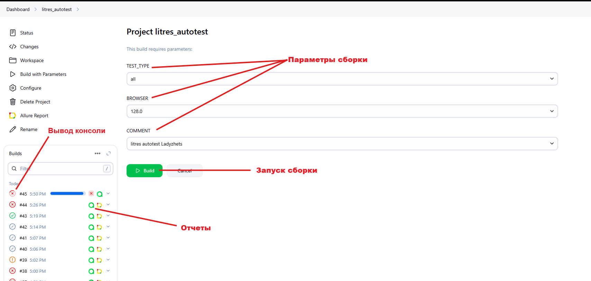

# Фреймворк для автоматизации тестирования сайта "ЛитРес"
> <a target="_blank" href="https://www.litres.ru/">litres.ru</a>


----

### Особенности проекта

* Оповещения о тестовых прогонах в Telegram
* Отчеты с видео, скриншотом, логами, исходной моделью разметки страницы
* Сборка проекта в Jenkins
* Отчеты Allure Report
* Интеграция с Allure TestOps
* Автоматизация отчетности о тестовых прогонах и тест-кейсах в Jira
* Запуск web/UI автотестов в Selenoid

### Список проверок, реализованных в web/UI автотестах

- [x] Поиск книги (через кнопку/нажатие Enter, а также поиск валидного/невалидного наименования книги)
- [x] Добавление книги в корзину
- [x] Удаление книги из корзины
- [x] Добавление книги в избранное (через страницу книги/корзину)
- [x] Удаление книги из избранного (через корзину/страницу Отложенного)

### Используемый стэк

          

----

### Локальный запуск
> Перед запуском в корне проекта создать файл .env с содержимым:
```
SELENOID_LOGIN='user1'
SELENOID_PASS='1234'
SELENOID_URL='selenoid.autotests.cloud'
```
> Для запуска web/UI автотестов выполнить:

```bash
python -m venv .venv
source .venv/bin/activate
pip install -r requirements.txt
pytest -s . --browser_version=${BROWSER_VERSION}
```

#### Получение отчёта:
```bash
allure serve build/allure-results
```

----

### Проект в Jenkins
> <a target="_blank" href="https://jenkins.autotests.cloud/job/litres_autotest/">Ссылка</a>

#### Параметры сборки
> [!NOTE]
> Параметры сборки не обязательны
```python
BROWSER_VERSION = ['128.0', '127.0'] # Версия браузера
ENVIRONMENT = ['STAGE', 'PREPROD', 'PROD'] # Окружение
COMMENT = ['litres autotest']
```
#### Запуск автотестов в Jenkins
1. Открыть <a target="_blank" href="https://jenkins.autotests.cloud/job/litres_autotest/">проект</a>


2. Нажать "Build with Parameters"
3. Из списка "ENVIRONMENT" выбрать любое окружение
4. Нажать "Build"



----

### Allure отчет
#### <a target="_blank" href="https://jenkins.autotests.cloud/job/Ivi-mobile-and-UI-Auto-Tests/15/allure/">Общие результаты</a>


#### <a target="_blank" href="https://jenkins.autotests.cloud/job/Ivi-mobile-and-UI-Auto-Tests/15/allure/#suites">Результаты прохождения теста</a>


#### <a target="_blank" href="https://jenkins.autotests.cloud/job/Ivi-mobile-and-UI-Auto-Tests/15/allure/#graph">Графики</a>


----

### Интеграция с Allure TestOps
> <a target="_blank" href="https://allure.autotests.cloud/project/4692/dashboards">Ссылка на проект</a>

#### <a target="_blank" href="https://allure.autotests.cloud/project/4692/dashboards">Дашборд с общими показателями тестовых прогонов</a>


#### <a target="_blank" href="https://allure.autotests.cloud/project/3910/launches">История запуска тестовых наборов</a>


#### <a target="_blank" href="https://allure.autotests.cloud/project/3910/test-cases/28510?treeId=0">Тест кейсы</a>


----

### Интеграция с Jira
> <a target="_blank" href="https://jira.autotests.cloud/browse/HOMEWORK-1429">Ссылка на проект</a>


----

### Оповещения в Telegram


