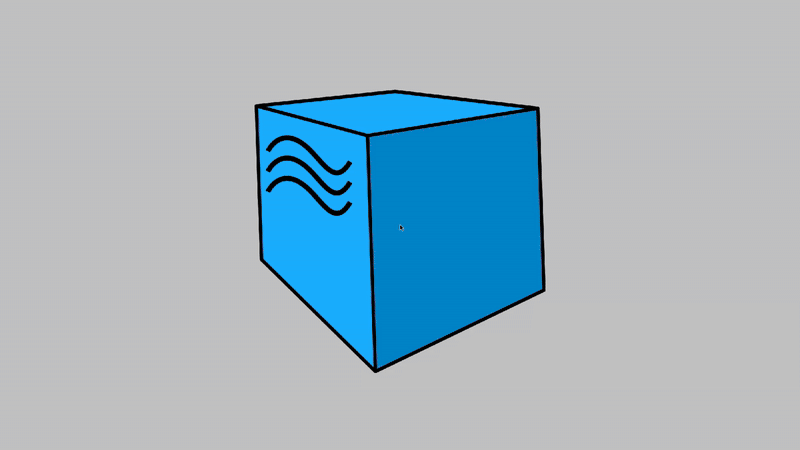

# Фреймворк для автоматизации тестирования сайта "ЛитРес"
> <a target="_blank" href="https://www.litres.ru/">litres.ru</a>


----

### Особенности проекта

* Оповещения о тестовых прогонах в Telegram
* Отчеты с видео, скриншотом, логами, исходной моделью разметки страницы
* Сборка проекта в Jenkins
* Отчеты Allure Report
* Интеграция с Allure TestOps
* Автоматизация отчетности о тестовых прогонах и тест-кейсах в Jira
* Запуск web/UI автотестов в Selenoid

<h3> Список проверок, реализованных в автотестах:</h3>

### UI-тесты

* ✅ Поиск книги (через кнопку/нажатие Enter, а также поиск валидного/невалидного наименования книги)
* ✅ Добавление книги в корзину
* ✅ Удаление книги из корзины
* ✅ Добавление книги в избранное (через страницу книги/корзину)
* ✅ Удаление книги из избранного (через корзину/страницу Отложенного)

### API-тесты

* ✅ Добавление книги в корзину
* ✅ Добавление книги в избранное
* ✅ Удаление книги из избранного
* ✅ Поиск книги (поиск валидного/невалидного наименования книги)

### Mobile-тесты

* ✅ Поиск книги (поиск валидного/невалидного наименования книги)
* ✅ Добавление книги в избранное
* ✅ Удаление книги из избранного

----

### Используемый стэк

             

----

### Локальный запуск
> Перед запуском в корне проекта создать файлы .env и env.credentials с содержимым:
```
SELENOID_LOGIN='user1'
SELENOID_PASS='1234'
SELENOID_URL='selenoid.autotests.cloud'
```
> и 
```
bstack_userName={your browserstack username}
bstack_accessKey={your browserstack password}
```
> соответственно

> Для локального запуска с дефолтными значениями необходимо выполнить команду:

```bash
python -m venv .venv
source .venv/bin/activate
pip install poetry
poetry install --no-root
pytest tests
```

#### Получение отчёта:
```bash
allure serve build/allure-results
```

----

###  Запуск проекта в Jenkins
> <a target="_blank" href="https://jenkins.autotests.cloud/job/litres_autotest/">Ссылка на проект в Jenkins</a>

#### Параметры сборки
> [!NOTE]
> Параметры сборки не обязательны
```python
TYPE_TEST = ['all', 'api', 'mobile', 'ui'] # Тип автотестов
BROWSER = ['128.0' '127.0'] # Версия браузера
COMMENT = ['litres autotest']
```
#### Запуск автотестов в Jenkins
1. Открыть <a target="_blank" href="https://jenkins.autotests.cloud/job/litres_autotest/">проект</a>


2. Нажать "Build with Parameters"
3. Из списка "TYPE_TEST" выбрать тип, который необходимо протестировать
4. Из списка "BROWSER" выбрать версию браузера
4. Нажать "Build"


----

###  Allure отчет
#### <a target="_blank" href="https://jenkins.autotests.cloud/job/Ivi-mobile-and-UI-Auto-Tests/15/allure/">Общие результаты</a>


#### <a target="_blank" href="https://jenkins.autotests.cloud/job/Ivi-mobile-and-UI-Auto-Tests/15/allure/#suites">Результаты прохождения теста</a>


#### <a target="_blank" href="https://jenkins.autotests.cloud/job/Ivi-mobile-and-UI-Auto-Tests/15/allure/#graph">Графики</a>


----

###  Интеграция с Allure TestOps
> <a target="_blank" href="https://allure.autotests.cloud/project/4692/dashboards">Ссылка на проект</a>

#### <a target="_blank" href="https://allure.autotests.cloud/project/4692/dashboards">Дашборд с общими показателями тестовых прогонов</a>


#### <a target="_blank" href="https://allure.autotests.cloud/project/3910/launches">История запуска тестовых наборов</a>


#### <a target="_blank" href="https://allure.autotests.cloud/project/3910/test-cases/28510?treeId=0">Тест кейсы</a>


----

###  Интеграция с Jira
> <a target="_blank" href="https://jira.autotests.cloud/browse/HOMEWORK-1429">Ссылка на проект</a>


----

###  Оповещения в Telegram


----
###  Пример видео прохождения ui-автотеста


----

###  Пример видео прохождения mobile-автотеста

